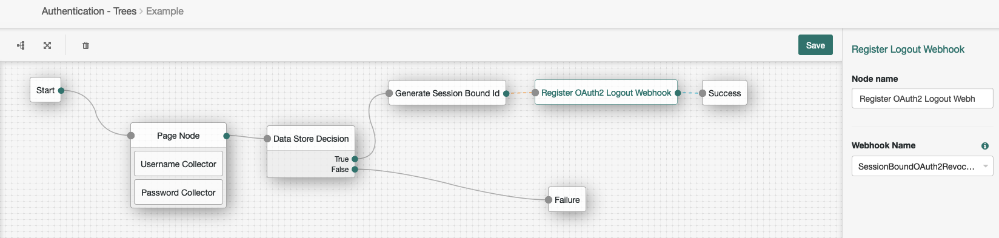
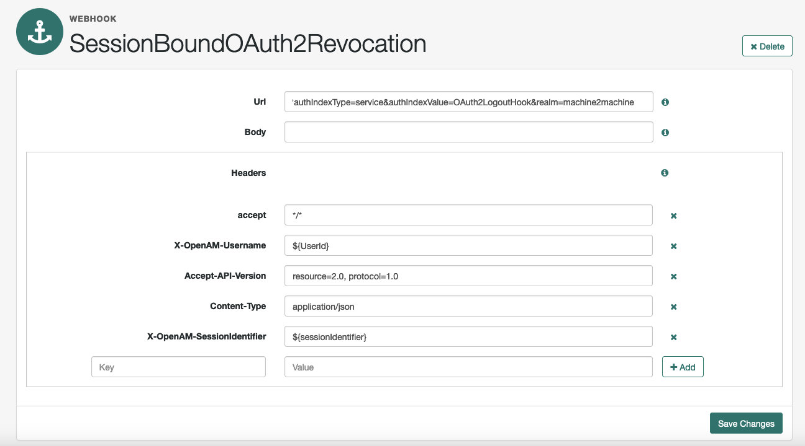
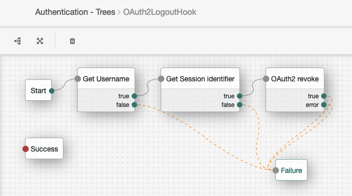

# Session-bound OAuth2 tokens revoke

## Introduction

Sample JS scripted node revokes session-bound OAuth2 tokens during Session logout. 
To achieve this, we need to "link" the Session with the indivual OAuth2 token. We can create a UUID that represents the session, then add it as OAuth2 token claim.
During logout, we call the *LEGACY* /frrest endpoints which can retrieve all user's tokens with its associated claims. Finally, we revoke each token that has session UUID as claim.

## Limitations

- frrest endpoints are marked as "Legacy"
- calling frrest endpoints requires an *amadmin* token
- not IDC compatible
- only OAuth2 stateful tokens are supported

## Configurations

The following scrips are required and can be found in the [src](src) directory:

- generate-session-identifier.js
This script generates a UUID and adds it as Session Property e.g.
```
	var sessionUUID = javaImports.UUID.randomUUID();
	action = javaImports.Action.goTo(nodeOutcomes.TRUE).putSessionProperty("sessionIdentifier", sessionUUID).build();
```

- OAuth2 Access Token Modification Script
Adds the session UUID claim as the token claim:
```
if (session != null) { // session is not available for resource owner password credentials grant
    try {
        accessToken.setField("sessionIdentifier", session.getProperty("sessionIdentifier"))
    } catch (SSOException ex) {
        logger.error("TasosDebug::Unable to retrieve session property value", ex)
    }
}
```
- oauth2-session-bound-tokens-revoke-script.js
This scripts call the frrest endpoints for retrieving and revoking user's tokens based on the session UUID claim.

Finally, 2 simple scripted nodes that gets the username and Session UUID headers. These headers are set by the Webook:

- get-username-from-header.js

- get-session-identifier-from-header.js

## Contents

Example base AM tree



The Logout webhook node is configured to use the following hook:



You need to create another Journey that's going to be called by the above Logout Webhook, as below:



This tree doesn't need to end up creating a session, therefore it's intentionally ending up to the Failure node.


## Testing 

- frrest endpoint response (OAuth2 tokens are bound to 2 different sessions)
```
.../frrest/oauth2/token?_queryId=userName%3Ddemo%2Crealm%3D%2Fmachine2machine&_fields=sessionIdentifier
{
    "result": [
        {
            "_id": "8ptGXNqjqdB76Yd0M0EHHxeD1cs",
            "_rev": "-1778152803",
            "sessionIdentifier": "68d6e63f-ba45-472a-9d9f-42dbb8de53e1"
        },
        {
            "_id": "BmFZURlALPgQw598D9UPPwPqDEQ",
            "_rev": "847692928",
            "sessionIdentifier": "68d6e63f-ba45-472a-9d9f-42dbb8de53e1"
        },
        {
            "_id": "fGRc-BRDe_jcLcppLl6LGj_IvgM",
            "_rev": "483447031"
        },
        {
            "_id": "W4_Juir-A0QeNmOfx4vzk2ncZzY",
            "_rev": "-1435594678",
            "sessionIdentifier": "09d8f8ad-7a59-43a4-898c-262caefd5bb5"
        },
        {
            "_id": "if1LtbLTLWpee2lfy1HFbd_pFBg",
            "_rev": "371875414",
            "sessionIdentifier": "09d8f8ad-7a59-43a4-898c-262caefd5bb5"
        }
    ],
    "resultCount": 5,
    "pagedResultsCookie": null,
    "totalPagedResultsPolicy": "NONE",
    "totalPagedResults": -1,
    "remainingPagedResults": -1
}
```

During logout, the Webhook will call the script with the folloing output:
```
ERROR: ******TasosDebug:OAuth2RevokeHook:get-username-from-header node executing
ERROR: ******TasosDebug:OAuth2RevokeHook:get-username-from-header UserId retrieved. Updating Tree state with username: demo
ERROR: ******TasosDebug::OAuth2RevokeHook:get-session-identifier-from-header node executing
ERROR: ******TasosDebug::OAuth2RevokeHook:get-session-identifier-from-header UserId retrieved. Updating Tree state with session identifier: 09d8f8ad-7a59-43a4-898c-262caefd5bb5
ERROR: ******TasosDebug::OAuth2RevokeHook node executing
ERROR: ******TasosDebug::OAuth2RevokeHook The user is demo
ERROR: ******TasosDebug::OAuth2RevokeHook The sessionIdentifier is 09d8f8ad-7a59-43a4-898c-262caefd5bb5
ERROR: ******TasosDebug::OAuth2RevokeHook Authenticating as administrator
ERROR: ******TasosDebug::OAuth2RevokeHook Returning admin token lHcYZvZWcxpJhXSDSQtSvEdzXR8.*AAJTSQACMDEAAlNLABxEZTZHNnYzWkxWcnErZ2dwQkc0NDJHR1Z3YU09AAR0eXBlAANDVFMAAlMxAAA.*
ERROR: ******TasosDebug::OAuth2RevokeHook Retrieving tokens
ERROR: ******TasosDebug::OAuth2RevokeHook Calling: http://anastasios-kampas-am-dihcahr.test:8080/openam/frrest/oauth2/token?_queryId=userName%3Ddemo%2Crealm%3D%2Fmachine2machine&_fields=sessionIdentifier with admin token lHcYZvZWcxpJhXSDSQtSvEdzXR8.*AAJTSQACMDEAAlNLABxEZTZHNnYzWkxWcnErZ2dwQkc0NDJHR1Z3YU09AAR0eXBlAANDVFMAAlMxAAA.*
ERROR: ******TasosDebug::OAuth2RevokeHook The response was: {"result":[{"_id":"8ptGXNqjqdB76Yd0M0EHHxeD1cs","_rev":"-1778152803","sessionIdentifier":"68d6e63f-ba45-472a-9d9f-42dbb8de53e1"},{"_id":"BmFZURlALPgQw598D9UPPwPqDEQ","_rev":"847692928","sessionIdentifier":"68d6e63f-ba45-472a-9d9f-42dbb8de53e1"},{"_id":"fGRc-BRDe_jcLcppLl6LGj_IvgM","_rev":"483447031"},{"_id":"W4_Juir-A0QeNmOfx4vzk2ncZzY","_rev":"-1435594678","sessionIdentifier":"09d8f8ad-7a59-43a4-898c-262caefd5bb5"},{"_id":"if1LtbLTLWpee2lfy1HFbd_pFBg","_rev":"371875414","sessionIdentifier":"09d8f8ad-7a59-43a4-898c-262caefd5bb5"}],"resultCount":5,"pagedResultsCookie":null,"totalPagedResultsPolicy":"NONE","totalPagedResults":-1,"remainingPagedResults":-1}
ERROR: ******TasosDebug::OAuth2RevokeHook Got 200 OK. Tokens count: 5
ERROR: ******TasosDebug::OAuth2RevokeHook Collect session-bound tokens.
ERROR: ******TasosDebug::OAuth2RevokeHook Found session-bound token W4_Juir-A0QeNmOfx4vzk2ncZzY
ERROR: ******TasosDebug::OAuth2RevokeHook Found session-bound token if1LtbLTLWpee2lfy1HFbd_pFBg
ERROR: ******TasosDebug::OAuth2RevokeHook Returning session-bound tokens.
ERROR: ******TasosDebug::OAuth2RevokeHook Revoking tokens
ERROR: ******TasosDebug::OAuth2RevokeHook Attempting to delete token: W4_Juir-A0QeNmOfx4vzk2ncZzY
ERROR: ******TasosDebug::OAuth2RevokeHook the token W4_Juir-A0QeNmOfx4vzk2ncZzY has been revoked
ERROR: ******TasosDebug::OAuth2RevokeHook Attempting to delete token: if1LtbLTLWpee2lfy1HFbd_pFBg
ERROR: ******TasosDebug::OAuth2RevokeHook the token if1LtbLTLWpee2lfy1HFbd_pFBg has been revoked
ERROR: ******TasosDebug::OAuth2RevokeHook OAuth2 Logout was successful
```